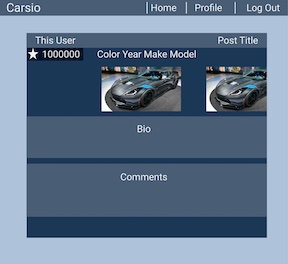

## Project Link

COMING SOON

# Project Title

Carsio

### Project Summary

Carsio is the ultimate tribute to your favorite cars. Users can create a page to pay homage to thier cars and browse other user's cars.

### User Stories

AAU I want to ...

- search and view car fan pages while not logged in (cannot edit post or comment)
- login
- Profile page - can view all my car fan pages (sorted by most likes first)
- Profile page - can view all liked "other users" car pages (sorted most recent first)
- Profile page - create / delete my car fan pages
- Search for other users car pages
- Car fan page - edit / delete / upload photo
- View other user car pages (logged in)
- Comment and like other user car pages
- Logout

### Wireframes

#### Login Page

#### Profile Page

#### Car Detail Page

#### Car Cards Display

### Technologies Used

- Python
- Django
- Postgres
- JavaScript
- CSS

# Coding Team

Nicholas JC Coles: <a href="https://www.linkedin.com/in/nicholas-jc-coles-314495a6/" target="_blank">LinkedIn</a> / <a href="https://github.com/jcoles1155" target="_blank">GitHub</a>

James Jin Hyung Kim: <a href="https://www.linkedin.com/in/jinhkim87/" target="_blank">LinkedIn</a> / <a href="https://github.com/jinhkim87" target="_blank">GitHub</a>

Tucker Craig: <a href="https://www.linkedin.com/in/tucker-m-craig/" target="_blank">LinkedIn</a> / <a href="https://github.com/TuckTuckC" target="_blank">GitHub</a>

Gregory Harper: <a href="https://www.linkedin.com/in/gregory-harper-71592067/" target="_blank">LinkedIn</a> / <a href="https://github.com/gharper235" target="_blank">GitHub</a>
